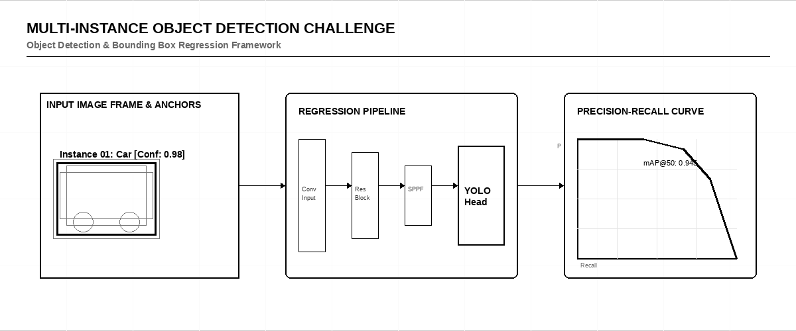

# 📦 Multi-Instance Object Detection Challenge

    

> [!IMPORTANT]
> **Host:** `Kaggle Community`  
> **Platform Link:** [Kaggle Competition](https://www.kaggle.com/competitions)  
> **Dataset Link:** [Kaggle Dataset](https://www.kaggle.com/competitions/data)  
> **Domain:** `Object Detection & Segmentation`

## 📖 Overview

Detecting and segmenting multiple instances of objects in complex scenes. Played around with Faster R-CNN, SSD, and YOLO architectures.

## ⚙️ Standard Pipeline Workflow

## 🗂️ Notebook Architecture & Inventory

### 📂 Inference & Submission
*Prediction pipeline and Kaggle submission file generation.*

| Script / Notebook | Type | Versions | Average Size | Core Stack / Techniques |
|:------------------|:-----|:---------|:-------------|:------------------------|
| 📁 **YOLO_Inference** | Multi-Version Script | [v1](./Inference%20%26%20Submission/YOLO_Inference/v1.ipynb), [v2](./Inference%20%26%20Submission/YOLO_Inference/v2.ipynb) | `Avg 190 KB` | `YOLO Object Detection, PyTorch, OpenCV` |
| 📁 **YOLO_Inference_2** | Multi-Version Script | [v1](./Inference%20%26%20Submission/YOLO_Inference_2/v1.ipynb), [v2](./Inference%20%26%20Submission/YOLO_Inference_2/v2.ipynb), [v3](./Inference%20%26%20Submission/YOLO_Inference_2/v3.ipynb) | `Avg 55 KB` | `YOLO Object Detection, PyTorch, OpenCV` |
| 📁 **YOLOv8_YOLO_Inference** | Multi-Version Script | [v1](./Inference%20%26%20Submission/YOLOv8_YOLO_Inference/v1.ipynb), [v10](./Inference%20%26%20Submission/YOLOv8_YOLO_Inference/v10.ipynb), [v11](./Inference%20%26%20Submission/YOLOv8_YOLO_Inference/v11.ipynb), [v12](./Inference%20%26%20Submission/YOLOv8_YOLO_Inference/v12.ipynb), [v13](./Inference%20%26%20Submission/YOLOv8_YOLO_Inference/v13.ipynb), [v14](./Inference%20%26%20Submission/YOLOv8_YOLO_Inference/v14.ipynb), [v15](./Inference%20%26%20Submission/YOLOv8_YOLO_Inference/v15.ipynb), [v16](./Inference%20%26%20Submission/YOLOv8_YOLO_Inference/v16.ipynb), [v17](./Inference%20%26%20Submission/YOLOv8_YOLO_Inference/v17.ipynb), [v18](./Inference%20%26%20Submission/YOLOv8_YOLO_Inference/v18.ipynb), [v19](./Inference%20%26%20Submission/YOLOv8_YOLO_Inference/v19.ipynb), [v2](./Inference%20%26%20Submission/YOLOv8_YOLO_Inference/v2.ipynb), [v20](./Inference%20%26%20Submission/YOLOv8_YOLO_Inference/v20.ipynb), [v21](./Inference%20%26%20Submission/YOLOv8_YOLO_Inference/v21.ipynb), [v22](./Inference%20%26%20Submission/YOLOv8_YOLO_Inference/v22.ipynb), [v23](./Inference%20%26%20Submission/YOLOv8_YOLO_Inference/v23.ipynb), [v24](./Inference%20%26%20Submission/YOLOv8_YOLO_Inference/v24.ipynb), [v25](./Inference%20%26%20Submission/YOLOv8_YOLO_Inference/v25.ipynb), [v26](./Inference%20%26%20Submission/YOLOv8_YOLO_Inference/v26.ipynb), [v27](./Inference%20%26%20Submission/YOLOv8_YOLO_Inference/v27.ipynb), [v28](./Inference%20%26%20Submission/YOLOv8_YOLO_Inference/v28.ipynb), [v29](./Inference%20%26%20Submission/YOLOv8_YOLO_Inference/v29.ipynb), [v3](./Inference%20%26%20Submission/YOLOv8_YOLO_Inference/v3.ipynb), [v30](./Inference%20%26%20Submission/YOLOv8_YOLO_Inference/v30.ipynb), [v31](./Inference%20%26%20Submission/YOLOv8_YOLO_Inference/v31.ipynb), [v32](./Inference%20%26%20Submission/YOLOv8_YOLO_Inference/v32.ipynb), [v33](./Inference%20%26%20Submission/YOLOv8_YOLO_Inference/v33.ipynb), [v34](./Inference%20%26%20Submission/YOLOv8_YOLO_Inference/v34.ipynb), [v35](./Inference%20%26%20Submission/YOLOv8_YOLO_Inference/v35.ipynb), [v36](./Inference%20%26%20Submission/YOLOv8_YOLO_Inference/v36.ipynb), [v37](./Inference%20%26%20Submission/YOLOv8_YOLO_Inference/v37.ipynb), [v38](./Inference%20%26%20Submission/YOLOv8_YOLO_Inference/v38.ipynb), [v39](./Inference%20%26%20Submission/YOLOv8_YOLO_Inference/v39.ipynb), [v4](./Inference%20%26%20Submission/YOLOv8_YOLO_Inference/v4.ipynb), [v40](./Inference%20%26%20Submission/YOLOv8_YOLO_Inference/v40.ipynb), [v41](./Inference%20%26%20Submission/YOLOv8_YOLO_Inference/v41.ipynb), [v42](./Inference%20%26%20Submission/YOLOv8_YOLO_Inference/v42.ipynb), [v43](./Inference%20%26%20Submission/YOLOv8_YOLO_Inference/v43.ipynb), [v44](./Inference%20%26%20Submission/YOLOv8_YOLO_Inference/v44.ipynb), [v45](./Inference%20%26%20Submission/YOLOv8_YOLO_Inference/v45.ipynb), [v46](./Inference%20%26%20Submission/YOLOv8_YOLO_Inference/v46.ipynb), [v47](./Inference%20%26%20Submission/YOLOv8_YOLO_Inference/v47.ipynb), [v48](./Inference%20%26%20Submission/YOLOv8_YOLO_Inference/v48.ipynb), [v49](./Inference%20%26%20Submission/YOLOv8_YOLO_Inference/v49.ipynb), [v5](./Inference%20%26%20Submission/YOLOv8_YOLO_Inference/v5.ipynb), [v50](./Inference%20%26%20Submission/YOLOv8_YOLO_Inference/v50.ipynb), [v51](./Inference%20%26%20Submission/YOLOv8_YOLO_Inference/v51.ipynb), [v52](./Inference%20%26%20Submission/YOLOv8_YOLO_Inference/v52.ipynb), [v53](./Inference%20%26%20Submission/YOLOv8_YOLO_Inference/v53.ipynb), [v54](./Inference%20%26%20Submission/YOLOv8_YOLO_Inference/v54.ipynb), [v55](./Inference%20%26%20Submission/YOLOv8_YOLO_Inference/v55.ipynb), [v56](./Inference%20%26%20Submission/YOLOv8_YOLO_Inference/v56.ipynb), [v57](./Inference%20%26%20Submission/YOLOv8_YOLO_Inference/v57.ipynb), [v58](./Inference%20%26%20Submission/YOLOv8_YOLO_Inference/v58.ipynb), [v59](./Inference%20%26%20Submission/YOLOv8_YOLO_Inference/v59.ipynb), [v6](./Inference%20%26%20Submission/YOLOv8_YOLO_Inference/v6.ipynb), [v60](./Inference%20%26%20Submission/YOLOv8_YOLO_Inference/v60.ipynb), [v61](./Inference%20%26%20Submission/YOLOv8_YOLO_Inference/v61.ipynb), [v62](./Inference%20%26%20Submission/YOLOv8_YOLO_Inference/v62.ipynb), [v63](./Inference%20%26%20Submission/YOLOv8_YOLO_Inference/v63.ipynb), [v64](./Inference%20%26%20Submission/YOLOv8_YOLO_Inference/v64.ipynb), [v65](./Inference%20%26%20Submission/YOLOv8_YOLO_Inference/v65.ipynb), [v66](./Inference%20%26%20Submission/YOLOv8_YOLO_Inference/v66.ipynb), [v67](./Inference%20%26%20Submission/YOLOv8_YOLO_Inference/v67.ipynb), [v68](./Inference%20%26%20Submission/YOLOv8_YOLO_Inference/v68.ipynb), [v69](./Inference%20%26%20Submission/YOLOv8_YOLO_Inference/v69.ipynb), [v7](./Inference%20%26%20Submission/YOLOv8_YOLO_Inference/v7.ipynb), [v70](./Inference%20%26%20Submission/YOLOv8_YOLO_Inference/v70.ipynb), [v71](./Inference%20%26%20Submission/YOLOv8_YOLO_Inference/v71.ipynb), [v72](./Inference%20%26%20Submission/YOLOv8_YOLO_Inference/v72.ipynb), [v73](./Inference%20%26%20Submission/YOLOv8_YOLO_Inference/v73.ipynb), [v74](./Inference%20%26%20Submission/YOLOv8_YOLO_Inference/v74.ipynb), [v75](./Inference%20%26%20Submission/YOLOv8_YOLO_Inference/v75.ipynb), [v76](./Inference%20%26%20Submission/YOLOv8_YOLO_Inference/v76.ipynb), [v77](./Inference%20%26%20Submission/YOLOv8_YOLO_Inference/v77.ipynb), [v78](./Inference%20%26%20Submission/YOLOv8_YOLO_Inference/v78.ipynb), [v79](./Inference%20%26%20Submission/YOLOv8_YOLO_Inference/v79.ipynb), [v8](./Inference%20%26%20Submission/YOLOv8_YOLO_Inference/v8.ipynb), [v80](./Inference%20%26%20Submission/YOLOv8_YOLO_Inference/v80.ipynb), [v81](./Inference%20%26%20Submission/YOLOv8_YOLO_Inference/v81.ipynb), [v82](./Inference%20%26%20Submission/YOLOv8_YOLO_Inference/v82.ipynb), [v83](./Inference%20%26%20Submission/YOLOv8_YOLO_Inference/v83.ipynb), [v84](./Inference%20%26%20Submission/YOLOv8_YOLO_Inference/v84.ipynb), [v85](./Inference%20%26%20Submission/YOLOv8_YOLO_Inference/v85.ipynb), [v86](./Inference%20%26%20Submission/YOLOv8_YOLO_Inference/v86.ipynb), [v87](./Inference%20%26%20Submission/YOLOv8_YOLO_Inference/v87.ipynb), [v88](./Inference%20%26%20Submission/YOLOv8_YOLO_Inference/v88.ipynb), [v89](./Inference%20%26%20Submission/YOLOv8_YOLO_Inference/v89.ipynb), [v9](./Inference%20%26%20Submission/YOLOv8_YOLO_Inference/v9.ipynb), [v90](./Inference%20%26%20Submission/YOLOv8_YOLO_Inference/v90.ipynb), [v91](./Inference%20%26%20Submission/YOLOv8_YOLO_Inference/v91.ipynb), [v92](./Inference%20%26%20Submission/YOLOv8_YOLO_Inference/v92.ipynb), [v93](./Inference%20%26%20Submission/YOLOv8_YOLO_Inference/v93.ipynb), [v94](./Inference%20%26%20Submission/YOLOv8_YOLO_Inference/v94.ipynb), [v95](./Inference%20%26%20Submission/YOLOv8_YOLO_Inference/v95.ipynb) | `Avg 2688 KB` | `YOLO Object Detection, PyTorch, OpenCV` |

---

## 🚀 Navigation & Usage Guidelines

> [!TIP]
> 1. **EDA & Preprocessing**: Verify data loaders, actigraphy or DICOM image transformations before model training.
> 2. **Training & Optimization**: Check model definition parameters and training logs to reproduce network weights.
> 3. **Inference & Post-Processing**: Run final pipelines to verify predictions and check submission formats.

---

> *"The camera isolates the target, completely blind to the surrounding darkness."*
>
> — **Vigneshwaran S**
